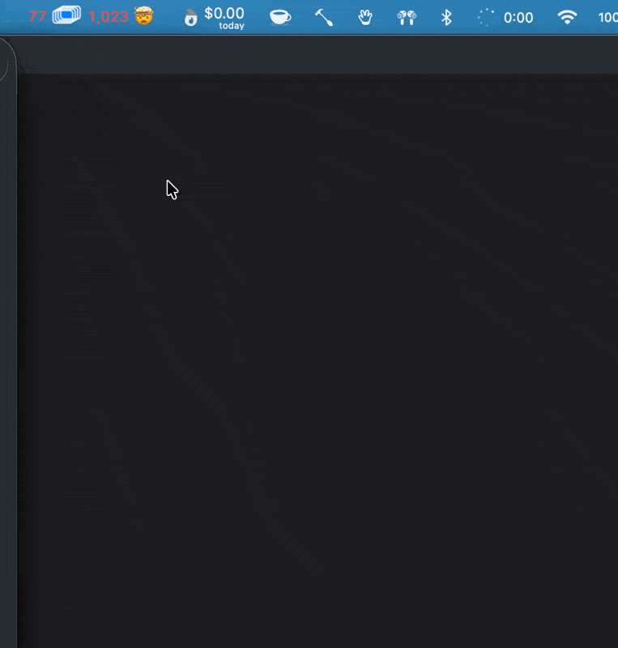

# TabCount

TabCount is a compact macOS menu bar utility for tracking open Google Chrome windows and tabs.



The menu bar title is intentionally short and uses a small dynamic window-stack icon:

```text
12 ▣ 1,234
```

Clicking the menu bar item shows the last count, an intraday chart, refresh time, data file path, and actions for refreshing or opening the data folder.

Use `Hide TabCount from Menu Bar` when you want TabCount to keep recording five-minute samples without occupying menu bar space. Open TabCount again from Spotlight or Finder to show it in the menu bar again. `Quit TabCount` stops the app and its five-minute sampling.

## Data files

TabCount writes its own files under:

```text
~/Library/Application Support/TabCount/
```

The five-minute samples are appended to:

```text
~/Library/Application Support/TabCount/history.jsonl
```

The latest sample is written to:

```text
~/Library/Application Support/TabCount/latest.json
```

These files are separate from anything updated by the `counttabs` shortcut or alias.

Each history line is JSON:

```json
{"recordedAt":"2026-05-28T17:00:00Z","tabs":123,"windows":12}
```

## Run

Run the menu bar app in development:

```sh
swift run tabcount
```

Install the menu bar app bundle:

```sh
./scripts/install-menu-bar-agent.sh
```

The installer builds a small `.app` bundle at `~/Applications/TabCount.app`. The menu bar app records a fresh sample every five minutes while it is running.

Install and start it hidden:

```sh
./scripts/install-menu-bar-agent.sh --hidden
```

Open the installed app:

```sh
open ~/Applications/TabCount.app
```

Remove it:

```sh
./scripts/uninstall-menu-bar-agent.sh
```

Count once without writing history:

```sh
swift run tabcount print
```

Count once and write to the TabCount history files:

```sh
swift run tabcount sample
```

Import the old `counttabs` CSV history:

```sh
swift run tabcount import-counttabs
```

Run the local verification script:

```sh
./scripts/test.sh
```

macOS will ask whether `TabCount` can control Google Chrome the first time the app runs. Accessibility is optional unless Chrome's AppleScript count underreports tabs; when that happens, TabCount shows a menu message and links to Privacy Settings rather than prompting on every launch. It does not request Screen Recording.
